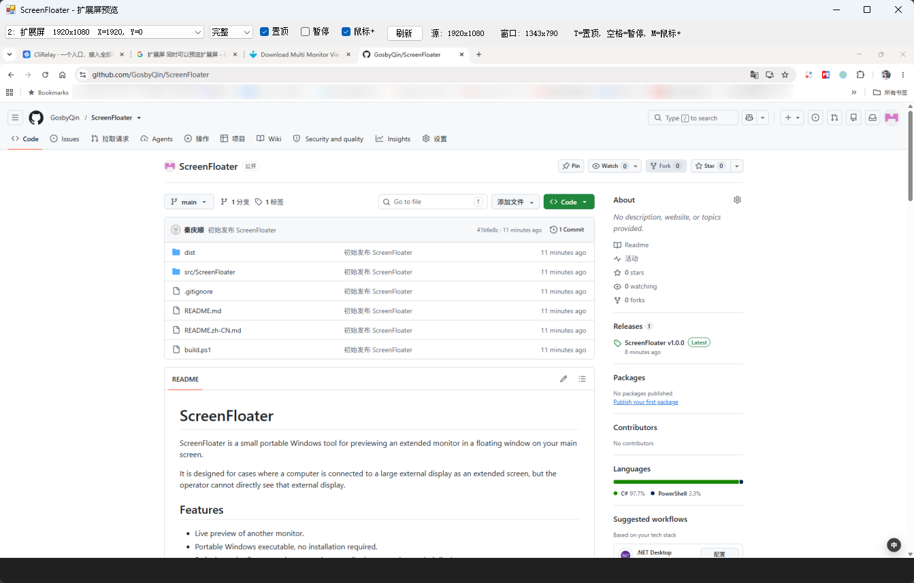

# ScreenFloater 扩展屏预览悬浮窗

[English README](README.md)

ScreenFloater 是一个极简的 Windows 小工具，用来在主屏上显示另一个显示器的实时预览窗口。

它适合这种场景：电脑外接大屏作为扩展屏，但操作者和大屏同向，或者坐在大屏背面，看不到大屏当前显示的内容。

## 运行效果



## 功能

- 实时预览另一个显示器。
- 免安装，双击即可运行。
- 默认优先选择第一个非主屏，通常就是外接扩展屏。
- 预览窗口可以拖动、缩放。
- 支持 `填满` / `完整` 两种显示模式：
  - `填满`：画面铺满预览窗口，减少黑边。
  - `完整`：保持原始比例，保证整屏都在预览里，窗口比例不一致时可能出现留边。
- 支持 `工作区` 捕获模式，裁掉任务栏或系统保留区域，适合去除扩展屏底部任务栏造成的黑边。
- 支持窗口置顶，方便一直显示在最前面。
- 支持暂停/继续刷新画面。
- 支持刷新显示器列表，适合插拔显示器后重新检测。
- 支持鼠标放大预览 `鼠标+`：
  - 黄色定位圈
  - 放大的鼠标指针
  - 鼠标附近区域的放大镜

## 运行方式

使用本文件夹里的可执行文件：

```text
ScreenFloater-x64-v5.exe
```

双击运行即可。

这是本地生成的未签名小程序，Windows 第一次运行时可能会出现 SmartScreen 提示。如果你确认信任这个本地程序，可以点击：

```text
更多信息 -> 仍要运行
```

## 基本用法

1. 连接外接大屏。
2. 在 Windows 显示设置里把多屏模式设为 `扩展`。
3. 双击运行 `ScreenFloater-x64-v5.exe`。
4. 程序会默认尝试预览第一个非主屏。
5. 如果预览的不是目标屏幕，可以用顶部下拉框切换显示器。
6. 拖动窗口边缘或角落可以调整预览窗口大小。
7. 保持 `置顶` 勾选，窗口就会显示在最前面。

## 顶部工具栏说明

| 控件 | 作用 |
| --- | --- |
| 显示器下拉框 | 选择要预览的屏幕。 |
| `填满` / `完整` | 切换预览显示方式。`填满` 会铺满窗口，`完整` 会保持比例显示整屏。 |
| `工作区` | 只预览屏幕工作区，通常会裁掉任务栏和系统保留区域。 |
| `置顶` | 置顶窗口，让预览窗口保持在最前。 |
| `暂停` | 暂停/继续刷新预览画面。 |
| `鼠标+` | 鼠标进入被预览屏幕后，显示放大的鼠标定位和放大镜。 |
| `刷新` | 重新扫描显示器，适合插拔屏幕后使用。 |

## 快捷键

| 快捷键 | 作用 |
| --- | --- |
| `T` | 开关置顶。 |
| `空格` | 暂停/继续刷新。 |
| `R` | 刷新显示器列表。 |
| `M` | 开关鼠标放大预览 `鼠标+`。 |

## 鼠标+ 放大模式

`鼠标+` 用来解决“扩展屏太大、预览窗口太小，看不清鼠标在哪”的问题。

当鼠标移动到正在被预览的屏幕上时，程序会显示：

- 鼠标位置附近的黄色定位圈
- 一个更大的鼠标指针
- 一个鼠标附近区域的放大镜窗口

放大镜默认显示在右下角。如果鼠标本身靠近右下角，放大镜会自动移动到左下角，尽量避免挡住鼠标位置。

如果不需要这个功能，可以取消勾选顶部的 `Mouse+`，或者按快捷键 `M`。

## 常见问题

### 预览的不是我想看的那个屏幕

用顶部的显示器下拉框切换屏幕。

通常：

- `Primary` 表示主屏。
- `Extended` 表示扩展屏。

### 插拔显示器后列表没有变化

点击 `Refresh`，或者按 `R`，重新扫描显示器。

### 预览视频时是黑屏

如果播放的是受 DRM 保护的视频内容，Windows 截图接口可能拿不到画面，因此预览会显示黑屏。

这是系统或内容保护限制，不是程序设置错误。

普通桌面、PPT、网页、软件界面一般都可以正常预览。

### 预览画面不完整，像被裁掉了一部分

先看窗口顶部显示的源尺寸：

```text
Source: 宽x高
```

再和 Windows 显示设置里的扩展屏实际分辨率对比。

如果两个尺寸不一致，说明当前显示器缩放或坐标环境比较特殊，需要继续调整截图模式。

### 鼠标放大镜挡住画面

可以关闭 `鼠标+`，或者按 `M`。

如果需要固定放大镜位置、调整放大倍数、只显示大鼠标不显示放大镜，也可以继续改程序。

### 程序占用资源吗

程序会持续截图并刷新预览，所以会有一定 CPU/GPU 占用。

普通 1080p/2K 办公、PPT、网页场景一般压力不大。如果预览 4K 大屏并且感觉卡顿，可以把预览窗口缩小，或者暂停时按 `空格`。

## 文件说明

| 文件 | 说明 |
| --- | --- |
| `ScreenFloater-x64-v5.exe` | 主程序，Windows 64 位免安装可执行文件。 |
| `ScreenFloater-说明.txt` | 简短说明。 |
| `README.md` | 英文说明文档。 |
| `README.zh-CN.md` | 中文说明文档。 |

## 当前版本

当前版本：

```text
ScreenFloater-x64-v5.exe
```

主要变化：

- 菜单栏改回中文标签。
- 新增 `填满` / `完整` 显示模式切换。
- 默认使用 `填满`，减少窗口比例不一致时看到的黑边。
- 新增 `工作区` 模式，默认裁掉任务栏/系统保留区域，减少扩展屏底部黑边。
- 新增鼠标放大预览 `鼠标+`。
- 新增黄色鼠标定位圈。
- 新增放大的鼠标指针。
- 新增鼠标附近区域的放大镜。
- 保留上一版的多显示器 DPI 适配修复，减少不同缩放比例时预览不完整的问题。
- 界面文字改为简短英文标签，降低不同 Windows 语言/编码环境下出现乱码的概率。

## 适用场景

- 会议室电脑外接大屏，但操作者看不到大屏。
- 演示时需要确认扩展屏正在显示什么。
- 大屏在身后、侧后方、展厅墙面或观众方向。
- 需要在主屏角落放一个扩展屏监看窗口。

## 不适合的场景

- 需要录制、推流或复杂场景切换：这类需求建议使用 OBS Studio。
- 需要捕获 DRM 保护视频：系统限制下可能无法正常预览。
- 需要远程传输屏幕画面：这个工具只在本机显示预览，不做网络传输。
